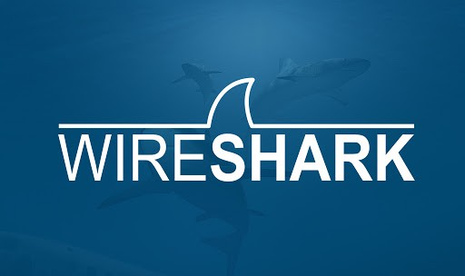

# Interface Web Wireshark Docker



Ce projet fournit une interface web Dockerisée pour Wireshark permettant d'analyser le trafic réseau en temps réel via votre navigateur.

## Structure du projet

```
wireshark-docker/
├── Dockerfile
├── src/
│   ├── app.py
│   └── templates/
│       └── index.html
├── .gitignore
└── README.md
```

## Fonctionnalités

- Interface web responsive
- Capture de paquets en temps réel
- Sélection d'interface réseau
- Filtrage des paquets
- Visualisation détaillée des captures
- Support de TShark

## Pour commencer

1. **Cloner le dépôt** :
   ```bash
   git clone https://github.com/votre-username/wireshark-docker.git
   cd wireshark-docker
   ```

2. **Construire l'image Docker** :
   ```bash
   docker build -t wireshark-web .
   ```

3. **Exécuter le conteneur** :
   ```bash
   docker run --name wireshark-web \
     --net=host \
     --privileged \
     -p 8080:8080 \
     wireshark-web
   ```

4. **Accéder à l'interface web** :
   Ouvrez votre navigateur et accédez à `http://localhost:8080`

## Configuration

Vous pouvez personnaliser le comportement via des variables d'environnement :

```bash
docker run --name wireshark-web \
  --net=host \
  --privileged \
  -p 8080:8080 \
  -e CAPTURE_INTERFACE=eth0 \
  -e CAPTURE_FILTER="port 80" \
  wireshark-web
```

Variables disponibles :
- `CAPTURE_INTERFACE` : Interface réseau à surveiller (défaut: "any")
- `CAPTURE_FILTER` : Filtre de capture BPF (exemple: "port 80")

## Utilisation de l'interface web

1. **Sélection de l'interface** :
   - Choisissez l'interface réseau dans le menu déroulant
   - L'option "Toutes les interfaces" capture sur toutes les interfaces

2. **Contrôles de capture** :
   - Cliquez sur "Démarrer la capture" pour commencer
   - Cliquez sur "Arrêter la capture" pour terminer

3. **Visualisation** :
   - Les paquets s'affichent en temps réel
   - Chaque paquet montre :
     - Horodatage
     - Adresse source
     - Adresse destination
     - Protocoles utilisés

## Sécurité

**Important** : Ce conteneur nécessite des privilèges élevés pour la capture réseau.
Pour la production :
- Limitez l'accès au port 8080
- Utilisez HTTPS
- Ajoutez une authentification
- Restreignez les interfaces accessibles

## Exigences

- Docker
- Navigateur web moderne
- Accès réseau privilégié sur l'hôte

## Licence

Ce projet est sous licence MIT. Voir le fichier LICENSE pour plus de détails.